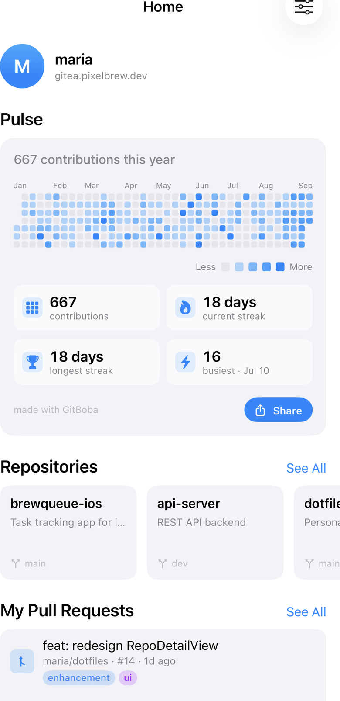

# GitBoba

A Gitea client for iPhone, iPad.

Browse and manage your self-hosted [Gitea](https://gitea.io) server — repos, pull requests, issues, Actions, and notifications — from a clean native SwiftUI app.

## Features

- **Home** — personalized feed of your repos, open PRs, and issues
- **Notifications** — Gitea notification inbox
- **Explore** — browse organizations and their repositories
- **Repos** — repo detail, branches, commits, file tree, PRs, issues
- **Actions** — workflow run list and job logs

## Requirements

- iOS 26+ / macOS 26+
- A self-hosted Gitea instance
- A Gitea API token (Settings → Applications → Generate Token)

## Privacy

GitBoba collects no data. All credentials are stored locally in the system Keychain. All network traffic goes directly to your own server.

[Full Privacy Policy](privacy)

## Support

[contact@miguelaperez.dev](mailto:contact@miguelaperez.dev)
